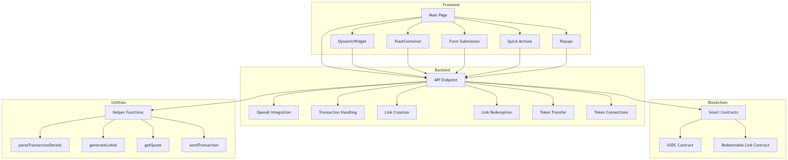

# Jiggly: Cross-Chain AI Agent

**Live URL:** [https://jiggly.vercel.app/](https://jiggly.vercel.app/)

## Start Generation Here

## End Generation Here

This is an AI-powered blockchain transaction assistant that enables seamless cross-chain operations through natural language processing. The application understands user intent and facilitates:
- Cross-chain token transfers
- Token swaps across networks
- Creation of redeemable token links
- Token connection discovery between chains
- Link redemption for receiving tokens

The assistant uses OpenAI to parse natural language requests and execute the appropriate blockchain transactions.

### Key Features
1. **Redeemable Links**  
   Create and share USDC links that can be redeemed by others. Perfect for:
   - Gifting tokens
   - Airdrops
   - Payment distributions

2. **Cross-Chain Transfers**  
   Transfer tokens between different blockchain networks with support for:
   - Source/destination chain selection
   - Token type specification
   - Amount specification
   - Recipient address input

3. **Token Connections Explorer**  
   Discover available token transfer routes between networks by querying:
   - Source chain
   - Destination chain
   - Source token
   - Destination token

### Supported Explorers, Networks & Contracts

**Explorer**
- Most of the supported networks explorer is used from Blockscout: 
- Contracts with explorers: 

**Mainnet Networks**
- **Ethereum Mainnet**  
  USDC: `0xA0b86991c6218b36c1d19D4a2e9Eb0cE3606eB48`  
  Redeemable Link: Not supported yet

- **Polygon Mainnet**  
  USDC: `0x3c499c542cEF5E3811e1192ce70d8cC03d5c3359`  
  Redeemable Link: Not supported yet

**Testnet Networks**
- **Ethereum Sepolia**  
  USDC: `0xD7EbB8244f65809F5a8De58456B019b0CD498e0B`  
  Redeemable Link: `0xcB32c2df9C31A41Ce003c10aaCd1896dE262b1c8`

- **Polygon Amoy**  
  USDC: `0x7eF93513e6f693da2D0b5719820E0dD4eB7e919b`  
  Redeemable Link: `0x04c6232C06f2db148061E412e9Ca2242e09095a2`

- **Hedera Testnet**  
  USDC: `0xBb95A888B4EBF96f8A7279Ea7A49A69cd4b12Ac9`  
  Redeemable Link: `0xe468b64D4c59AA00C0287e29FFdbA006E0F4468b`

- **Flow Testnet**  
  USDC: `0xBb95A888B4EBF96f8A7279Ea7A49A69cd4b12Ac9`  
  Redeemable Link: `0xe468b64D4c59AA00C0287e29FFdbA006E0F4468b`

- **Scroll Sepolia**  
  USDC: `0xBb95A888B4EBF96f8A7279Ea7A49A69cd4b12Ac9`  
  Redeemable Link: `0xe468b64D4c59AA00C0287e29FFdbA006E0F4468b`

- **Mantle Testnet**  
  USDC: `0xBb95A888B4EBF96f8A7279Ea7A49A69cd4b12Ac9`  
  Redeemable Link: `0xe468b64D4c59AA00C0287e29FFdbA006E0F4468b`

- **Inco Rivest Testnet**  
  USDC: `0xBb95A888B4EBF96f8A7279Ea7A49A69cd4b12Ac9`  
  Redeemable Link: `0xe468b64D4c59AA00C0287e29FFdbA006E0F4468b`

- **Zircuit Testnet**  
  USDC: `0xBb95A888B4EBF96f8A7279Ea7A49A69cd4b12Ac9`  
  Redeemable Link: `0xe468b64D4c59AA00C0287e29FFdbA006E0F4468b`

- **Unichain V4**
  USDC: `0x2418c9Ff4494b37227b5c525601A64F8c58c4152`  
  Redeemable Link: `0x71A7dac14d9FdE4396A800209c29d2Af2Ff6E6d7`

### Usage Examples
> There might be processing issues; we have added quick actions to make it easier to use.

- **Creating a Redeemable Link**  
  "Create a redeemable link for 5 USDC on ETH"

- **Redeeming a Link**  
  "Redeem link ABC123 on ETH"

- **Cross-Chain Transfer**  
  "Transfer 10 USDC TOKEN from ETH CHAIN to POL TOKEN in POL CHAIN"

- **Token Connection Query**  
  "Show me all possible connections OF ETH TOKEN in ETH CHAIN to MATIC TOKEN in POL CHAIN"

### Technical Implementation
The system uses:
- OpenAI for natural language processing
- Dynamic Wallet SDK for blockchain interactions
- Viem for Ethereum interactions
- Custom smart contracts for redeemable links

### Note
For testnet implementations, we use Mock USDC contracts that are fully ERC20 compatible. These can be replaced with actual USDC contracts for mainnet deployments.
